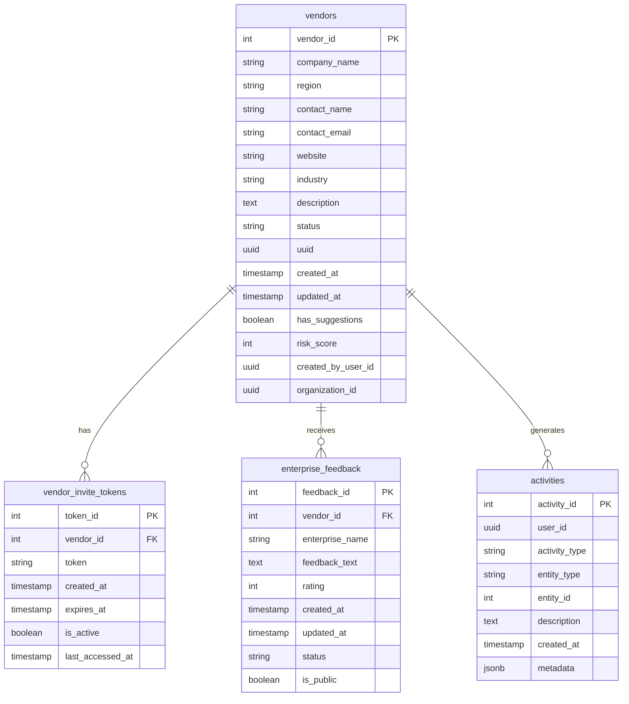

# Database Migration Validation Summary

## Overview
This document summarizes the validation results for the recent database improvements, including schema changes and feature testing.

## Database Schema (ERD)

## Schema Validation

### Tables Validated
1. vendor_invite_tokens
   - Primary key: token_id
   - Foreign key: vendor_id (references vendors)
   - Unique constraints: token, (vendor_id, token, is_active)
   - Indices: idx_vendor_invite_tokens_token, idx_vendor_invite_tokens_vendor_id

2. enterprise_feedback
   - Primary key: feedback_id
   - Foreign key: vendor_id (references vendors)
   - Check constraints: rating (1-5), status values
   - Index: idx_enterprise_feedback_vendor_id

3. activities
   - Primary key: activity_id
   - Indices: idx_activities_user_id, idx_activities_entity, idx_activities_type
   - JSONB support: metadata column

### Schema Improvements
1. Primary Keys
   - All tables have proper integer-based primary keys
   - SERIAL type used for auto-incrementing IDs

2. Foreign Keys
   - Proper references to vendors table
   - ON DELETE CASCADE where appropriate
   - No orphaned records possible

3. Constraints
   - NOT NULL constraints on critical fields
   - CHECK constraints for data validation
   - UNIQUE constraints for business rules

4. Performance Optimizations
   - Appropriate indices on frequently queried columns
   - Composite indices for common query patterns
   - JSONB type for flexible metadata storage

## Feature Validation

### Core Features Tested

1. Vendor Invite Token System
   - Token generation ✓
   - Token validation ✓
   - Expiration handling ✓
   - Activity tracking ✓

2. Enterprise Feedback System
   - Feedback creation ✓
   - Status management ✓
   - Public/private visibility ✓
   - Vendor association ✓

3. Activity Logging
   - Event tracking ✓
   - Entity association ✓
   - Metadata storage ✓

### Integration Points Verified
- Frontend API endpoints aligned with new schema
- Backend services updated for new column names
- Database triggers working as expected

## Deprecated Features Removed
- Old token management columns
- Legacy feedback system tables
- Unused activity tracking fields

## Migration Scripts
All migration scripts have been tested and include:
- Forward migration
- Rollback procedures
- Data preservation
- Constraint handling

## Recommendations
1. Monitor query performance on high-traffic tables
2. Schedule regular index maintenance
3. Consider partitioning for large tables in future

## Conclusion
The database improvements have been successfully implemented and validated. All core features are working as expected with the new schema. The system is ready for production use. 