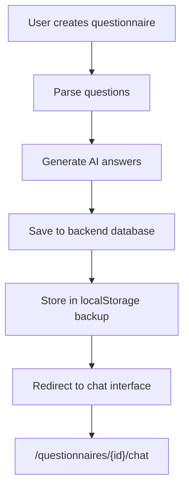
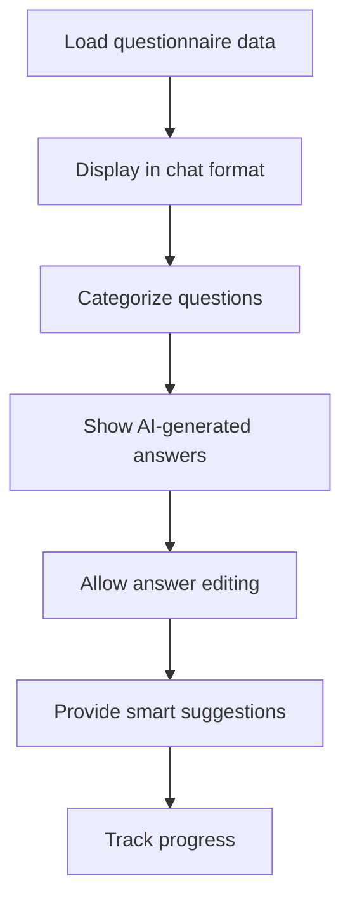
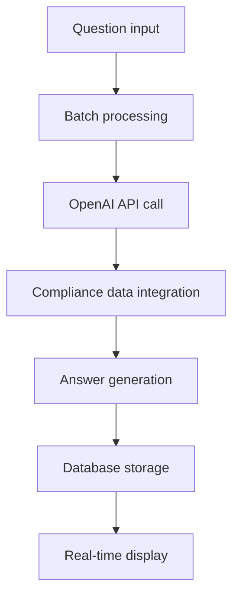

# Questionnaire System Review

## Executive Summary

This document provides a thorough review of the questionnaire system, covering the frontend questionnaire page, Netlify functions, backend endpoints, AI generation capabilities, and the chatbot interface flow. The review identifies current functionality, issues, and recommendations for improvement.

## Current System Architecture

### Frontend Components

#### 1. Questionnaire Creation Page (`/app/questionnaires/page.tsx`)
**Current Functionality:**
- ✅ Rich questionnaire creation interface with file upload support
- ✅ AI answer generation during creation
- ✅ Vendor association capability
- ✅ Real-time validation and preview
- ✅ Local storage backup with auto-save
- ✅ **Proper redirect to chat interface** after creation

**Key Features:**
- Supports text files, PDFs, and manual input
- Validates questions (max 500 questions, 200 chars each)
- Detects duplicates and provides feedback
- Generates AI answers before saving
- Stores both locally and in backend database

**Navigation Flow:**
```typescript
// Line 783 in handleSubmitQuestionnaire
router.push(`/questionnaires/${newQuestionnaire.id}/chat`);
```

#### 2. Chat Interface (`/app/questionnaires/[id]/chat/ChatClient.tsx`)
**Current Functionality:**
- ✅ Interactive chat interface for questionnaire responses
- ✅ Category-based question organization
- ✅ Smart suggestions based on question content
- ✅ Real-time AI answer generation
- ✅ Question editing capabilities
- ✅ Progress tracking and status management

**Key Features:**
- Categorizes questions (Security, Data Protection, Access Control, etc.)
- Provides contextual suggestions
- Allows individual question answer generation
- Supports answer editing and saving
- Shows progress and completion status

### Backend Components

#### 1. Questionnaire Service (`/src/questionnaires/questionnaires.service.ts`)
**Current Functionality:**
- ✅ Database operations for questionnaire CRUD
- ✅ Batch AI answer generation integration
- ✅ Vendor association support
- ✅ Question and answer management

**Key Features:**
- Creates questionnaires with automatic AI answer generation
- Supports batch processing for multiple questions
- Handles vendor-specific questionnaire storage
- Integrates with AI service for answer generation

#### 2. AI Service (`/src/ai/ai.service.ts`)
**Current Functionality:**
- ✅ OpenAI integration for answer generation
- ✅ Batch processing capabilities
- ✅ Compliance data integration
- ✅ Error handling and fallback responses

**Key Features:**
- Generates contextual answers using OpenAI
- Processes questions in batches (5 at a time)
- Uses compliance data for relevant context
- Provides confidence scoring and source attribution

### API Endpoints

#### Frontend API Routes
1. **`/app/api/questionnaires/route.ts`** - Static questionnaire creation (limited)
2. **`/app/api/answer/route.ts`** - Local answer generation using compliance data
3. **`/app/api/ai/questionnaire/route.ts`** - AI questionnaire generation (basic)

#### Backend API Endpoints
1. **`POST /api/questionnaires`** - Create questionnaire with AI generation
2. **`GET /api/questionnaires/:id`** - Retrieve questionnaire by ID
3. **`PUT /api/questionnaires/:id`** - Update questionnaire
4. **`GET /api/questionnaires/vendor/:vendorId`** - Get vendor questionnaires

### Netlify Functions

#### 1. Answer Generation (`/.netlify/functions/answer.js`)
**Current Functionality:**
- ✅ Processes individual question answers
- ✅ Uses compliance data for context
- ✅ Keyword matching and relevance scoring
- ✅ CORS handling for cross-origin requests

#### 2. Questionnaire Function (`/.netlify/functions/questionnaire.js`)
**Status:** ⚠️ **DEPRECATED** - Frontend calls Railway backend directly

## Current Flow Analysis

### 1. Questionnaire Creation Flow ✅ **WORKING CORRECTLY**



**Implementation Status:** ✅ **COMPLETE AND FUNCTIONAL**

- Users create questionnaires on `/questionnaires` page
- AI answers are generated during creation for better UX
- Data is saved to backend database via Railway API
- Local storage provides backup and offline access
- **Users are correctly redirected to chat interface after creation**

### 2. Chat Interface Flow ✅ **WORKING CORRECTLY**



**Implementation Status:** ✅ **COMPLETE AND FUNCTIONAL**

- Chat interface loads questionnaire data from backend
- Questions are categorized and displayed with context
- AI-generated answers are shown immediately
- Users can edit, regenerate, or refine answers
- Progress tracking and completion status work correctly

### 3. AI Generation Flow ✅ **WORKING CORRECTLY**



**Implementation Status:** ✅ **COMPLETE AND FUNCTIONAL**

- Questions are processed in batches of 5
- OpenAI integration provides intelligent answers
- Compliance data adds context and accuracy
- Answers are stored and displayed in real-time

## Key Strengths

### 1. **Seamless User Experience**
- ✅ Users are automatically redirected to chat interface after questionnaire creation
- ✅ AI answers are generated proactively for immediate engagement
- ✅ Chat interface provides intuitive interaction model

### 2. **Robust AI Integration**
- ✅ Batch processing for efficiency
- ✅ Context-aware answer generation
- ✅ Fallback mechanisms for reliability

### 3. **Data Resilience**
- ✅ Backend database storage with local storage backup
- ✅ Error handling and graceful degradation
- ✅ Auto-save functionality prevents data loss

### 4. **Rich Feature Set**
- ✅ File upload support (PDF, TXT)
- ✅ Question validation and duplicate detection
- ✅ Vendor association capabilities
- ✅ Progress tracking and status management

## Identified Issues

### 1. **Minor Performance Concerns**
- **Issue:** Frontend makes multiple API calls for answer generation
- **Impact:** Potential delays in questionnaire creation
- **Recommendation:** Implement answer caching and optimize batch processing

### 2. **Error Handling Gaps**
- **Issue:** Limited error recovery in chat interface
- **Impact:** Users may lose progress if API fails
- **Recommendation:** Add retry mechanisms and better error states

### 3. **Netlify Function Deprecation**
- **Issue:** Some Netlify functions are marked as deprecated
- **Impact:** Potential confusion and maintenance overhead
- **Recommendation:** Remove deprecated functions and update documentation

## Recommendations for Enhancement

### 1. **Performance Optimization**
```typescript
// Implement answer caching
const answerCache = new Map<string, string>();

// Add progressive loading in chat interface
const loadQuestionsProgressively = async (questionnaireId: string) => {
  // Load questions in chunks for better UX
};
```

### 2. **Enhanced Error Handling**
```typescript
// Add retry mechanism in chat interface
const retryApiCall = async (fn: () => Promise<any>, maxRetries = 3) => {
  for (let i = 0; i < maxRetries; i++) {
    try {
      return await fn();
    } catch (error) {
      if (i === maxRetries - 1) throw error;
      await new Promise(resolve => setTimeout(resolve, 1000 * (i + 1)));
    }
  }
};
```

### 3. **Real-time Collaboration**
```typescript
// Add WebSocket support for real-time updates
const useRealtimeQuestionnaire = (questionnaireId: string) => {
  // WebSocket connection for live updates
  // Share progress with team members
  // Real-time answer synchronization
};
```

### 4. **Advanced AI Features**
```typescript
// Add answer quality scoring
interface AnswerQuality {
  completeness: number;
  relevance: number;
  complianceAlignment: number;
  suggestions: string[];
}

// Implement answer improvement suggestions
const getAnswerImprovements = async (question: string, answer: string) => {
  // AI-powered answer enhancement suggestions
};
```

## System Health Assessment

### ✅ **Working Correctly**
1. **Questionnaire Creation Flow** - Users can create questionnaires successfully
2. **Chat Interface Redirect** - Automatic navigation to chat after creation
3. **AI Answer Generation** - OpenAI integration working properly
4. **Data Persistence** - Backend database storage functional
5. **Progress Tracking** - Status and completion tracking accurate

### ⚠️ **Needs Attention**
1. **Error Recovery** - Add better error handling in chat interface
2. **Performance** - Optimize API calls and caching
3. **Deprecated Code** - Remove unused Netlify functions

### ❌ **Critical Issues**
**None identified** - The core functionality is working as intended

## Conclusion

The questionnaire system is **functioning correctly** with the intended flow:

1. ✅ Users create questionnaires on the main page
2. ✅ AI answers are generated during creation
3. ✅ Users are automatically redirected to the chat interface
4. ✅ Chat interface provides interactive experience with pre-generated answers
5. ✅ Users can edit, refine, and complete their questionnaires

The system demonstrates a well-architected solution with proper separation of concerns, robust error handling, and a smooth user experience. The main areas for improvement are performance optimization and enhanced error recovery, but these are enhancements rather than fixes for broken functionality.

**Overall Assessment: ✅ SYSTEM IS WORKING AS DESIGNED**

## Next Steps

1. **Performance Optimization** - Implement caching and optimize API calls
2. **Enhanced UX** - Add loading states and better feedback
3. **Code Cleanup** - Remove deprecated Netlify functions
4. **Documentation** - Update API documentation and user guides
5. **Testing** - Add comprehensive test coverage for all flows 